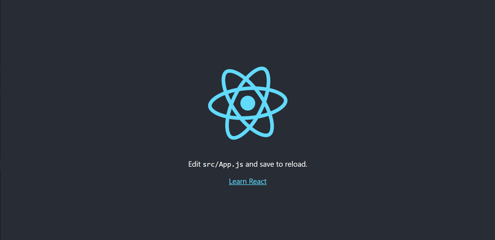

# Snapshot Testing with React and Jest

## Introduction

[Snapshot Testing](https://www.sitepen.com/blog/snapshot-testing-benefits-and-drawbacks) enables you to verify that your output for a visual component continues to function as planned. This is highly promising since, as your code evolves over time, there is a greater chance that these changes may result in unanticipated behavior. 

Snapshot testing differs from [Test-Driven Development](https://martinfowler.com/bliki/TestDrivenDevelopment.html) (TDD) in its method to writing tests. For a [React](https://reactjs.org/) component, code must first be in a functioning condition. Then, produce a snapshot of the predicted outcome given the specified inputs. The snapshot tests are then committed concurrently with the component.

Similar to unit testing, [Jest](https://jestjs.io/) will compare the snapshot to the rendered output for the test, yielding two potential outcomes, pass or fail. In the instance of a test failure, there are two possible outcomes. If the test findings are unexpected, you may need to resolve a component problem (True Negative). If the test results are anticipated, the snapshot tests must be modified to accommodate the new output (False Negative).

This lesson will cover snapshot tests and how they can be used to guarantee that your user interface (UI) does not change unexpectedly.

## Prerequisites

Installing [Node.js](https://nodejs.org/en/) locally is required to complete this tutorial; you can do so by following how to [Install Node.js and NPM](https://nodejs.org/en/download/). Some knowledge of React and Jest may be advantageous, but is not required. This tutorial also uses [Visual Studio Code](https://code.visualstudio.com/) as a code editor and to run an integrated terminal for convenience. However, you may substitute an editor and terminal of your choosing.

## Steps

### 1- Creating a Basic React Webpage

To have anything to test, you must first construct a React application using [Create React App](https://create-react-app.dev/). The project name for this tutorial is react-jest-snapshot-testing.

```bash
npx create-react-app react-jest-snapshot-testing
```

Once it is done, enter the project folder 

```bash
cd react-jest-snapshot-testing
```

In the project folder run [npm install](https://docs.npmjs.com/cli/v8/commands/npm-install) to install its dependencies

```bash
npm install
```

Run [npm start](https://docs.npmjs.com/cli/v8/commands/npm-start) in order to serve your application.

```bash
npm start
```

Finally, go to http://localhost:3000 in order to visualize your webpage, it should look like this:



### 2- Creating a Custom Component

In this part, we'll develop a custom link component that encloses an [anchor tag](https://www.geeksforgeeks.org/html-a-tag/).

Create a folder named ```components``` inside the ```src``` folder of the project and navigate to it.

```bash
cd src && mkdir components && cd components
```

Create a file named ```Link.js```, this is where we will code our custom component. It should resemble this code snippet:

```js

import React from 'react';

const Link = (props => (
    <a id={props.id} href={props.url}> {props.text} </a>
));

export default Link;

```

Go back to the ```src``` folder and enter the ```App.js``` file to edit the following tag:
```diff
+ import Link from './components/Link'
import logo from './logo.svg';
import './App.css';

function App() {
  return (
    <div className="App">
      <header className="App-header">
        
        <p>
          Edit <code>src/App.js</code> and save to reload.
        </p>
-        <a
-          className="App-link"
-          href="https://reactjs.org"
-          target="_blank"
-          rel="noopener noreferrer"
-        >
-          Learn React
-        </a>
+       <Link id={'myLink'} url={'https://reactjs.org/docs/getting-started.html'} text={'Get Started'} />
      </header>
    </div>
  );
}

export default App;

```

If you reload the application, you will be able to see that we changed the 'Learn React' anchor text to a 'Get started' link that points to the React getting started docs.

### 3 - Creating Your First Component Snapshot Test


First, delete the ```App.test.js``` file inside the ```src``` folder.

Then install [react-test-renderer](https://reactjs.org/docs/test-renderer.html), a library that allows to render React components for testing.

```bash
npm install react-test-renderer
```

Inside the ```components``` folder, let's create a file called ```Link.test.js```, then write the following code:

```js
import React from 'react';
import renderer from 'react-test-renderer';
import Link from './Link';

it(`renders correctly with given props`, () => {
  const linkJsonSnapshot = 
    renderer.create(<Link id={'myLink'} url={'https://reactjs.org/docs/getting-started.html'} text={'Get Started'} />)
    .toJSON();
  expect(linkJsonSnapshot).toMatchSnapshot();
});
```

Since Jest already comes pre-installed in the ```create-react-app``` template, just run ```npm test```

```bash
npm test
```

After running the command, you will see an output like this:

```
 PASS  src/components/Link.test.js
  √ renders correctly with given props (21 ms)

 › 1 snapshot written.
Snapshot Summary
 › 1 snapshot written from 1 test suite.

Test Suites: 1 passed, 1 total
Tests:       1 passed, 1 total
Snapshots:   1 written, 1 total
Time:        3.232 s
Ran all test suites related to changed files.
```

This means a snapshot of the rendered link component has been written in the ```_snapshots_``` folder. The snapshot of the test we just wrote is now called ```Link.test.js.snap``` and has the following content:

```
// Jest Snapshot v1, https://goo.gl/fbAQLP

exports[`renders correctly with given props 1`] = `
<a
  href="https://reactjs.org/docs/getting-started.html"
  id="myLink"
>
   
  Get Started
   
</a>
`;
```

Now, everytime we run the ```npm test``` command, Jest will compare the renderered component to the snapshot, passing the test as long as the data is still intact.

But, what happens when we change the data?

### 4 - Handling failures in Snapshot Testing

Let's begin by changing the props of the ```Link``` component in the test:

```diff
import React from 'react';
import renderer from 'react-test-renderer';
import Link from './Link';

it(`renders correctly with given props`, () => {
  const linkJsonSnapshot = 
-    renderer.create(<Link id={'myLink'} url={'https://reactjs.org/docs/getting-started.html'} text={'Get Started'} />)
+    renderer.create(<Link id={'myNewLink'} url={'https://reactjs.org/docs/getting-started.html'} text={'Get Started'} />)
    .toJSON();
  expect(linkJsonSnapshot).toMatchSnapshot();
});
```

Then, when we run ```npm test``` again, we can see that the test failed.

```
 FAIL  src/components/Link.test.js
  × renders correctly with given props (19 ms)

  ● renders correctly with given props

    expect(received).toMatchSnapshot()

    Snapshot name: `renders correctly with given props 1`

    - Snapshot  - 1
    + Received  + 1

      <a
        href="https://reactjs.org/docs/getting-started.html"
    -   id="myLink"
    +   id="myNewLink"
      >
         
        Get Started
         
      </a>
```

Luckily, Jest offers us a possible fix:

```
 › Press u to update failing snapshots.
 › Press i to update failing snapshots interactively.
```

If we identify that the change was not expected, we can go back to the test file and edit the id prop back to its original value (in the snapshot). If the change was expected, we can then update the failing snapshot.

Finally, if we either edit the test file back to the original contents or updated the snapshot file, the test will now continue to pass.

## References
[https://jestjs.io/docs/snapshot-testing](https://jestjs.io/docs/snapshot-testing)
[https://www.digitalocean.com/community/tutorials/how-to-write-snapshot-tests-for-react-components-with-jest](https://www.digitalocean.com/community/tutorials/how-to-write-snapshot-tests-for-react-components-with-jest)
[https://blog.openreplay.com/react-snapshot-testing-with-jest-an-introduction-with-examples](https://blog.openreplay.com/react-snapshot-testing-with-jest-an-introduction-with-examples)

